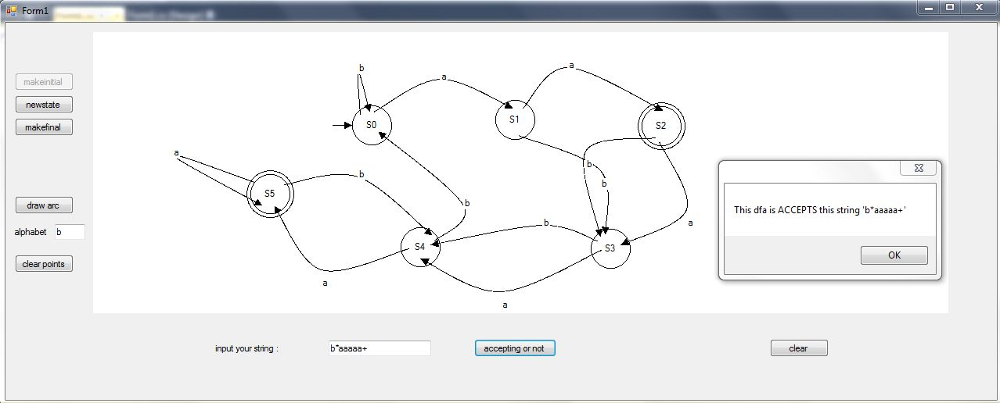

# DFAaccepting
A program to determine if a string is accepted by a DFA (Deterministic Finite Automata) or not ?

In [!automata theory](https://en.wikipedia.org/wiki/Automata_theory), a branch of [!theoretical computer science](https://en.wikipedia.org/wiki/Theoretical_computer_science), a **deterministic finite automaton (DFA)**—also known as **deterministic finite state machine**—is a [!finite state machine](https://en.wikipedia.org/wiki/Finite_state_machine) that accepts/rejects finite strings of symbols and only produces a unique computation (or run) of the automaton for each input string. 'Deterministic' refers to the uniqueness of the computation. (by [!wikipedia](https://en.wikipedia.org/wiki/Deterministic_finite_automaton))

In this project I wrote a program that the user can draw a DFA on it and then pass a string to it and the program should compute if is this string accepted by this DFA or not.

The source code is written in C# and is a visual studio 2010 windows form project.

You can find the installation file under the "Setup" folder.

 

Because every DFA is defined by its states, alphabets, transitions, initial state and final states we gonna define our DFA class as (the size attribute is added instead of states because if we give a number to any state from zero the size of dfa will show the states we used on its own):

```cs
class DFA
{
       public int size;//the number of states in DFA
       public List<string> alphabets;//alphabets used in this DFA
       public Dictionary<string, string> transitions = new Dictionary<string, string>();//transitions in this DFA
       public String initial;//initial state of DFA
       public List<string> finals;//set of accepted states of DFA
       public DFA(int _size, List<string> _alphabets, Dictionary<string, string> _transitions, String _initial, List<string> _finals)
       {//constructor that gives values to parameters defined above
              size = _size;
              alphabets = _alphabets;
              transitions = _transitions;
              initial = _initial;
              finals = _finals;
       }
}
```
so after defining our DFA we need a way to represent our states on screen :
```cs
class State
{
     public string name;
     public int x;
     public int y;
     public int width = 50;
     private double distancefromcenter(int x1, int y1)//computes a points distance from center of this state
     {
          return (double) Math.Sqrt(Math.Pow(x1 - x, 2) + Math.Pow(y1 - y, 2));
     }
     public bool isonit(int x1,int y1)//computes if a point is on this state or not
     {
     if (distancefromcenter(x1, y1) <= width/2)
          return true;
     else
          return false;
     }
}
```
now that we defined these it is time to compute is a string is accepted by this DFA or not (please note that i won't speak about the process of drawing states and arcs)
```cs
private static bool dfaaccepting(DFA dfa,String s)
{
     int i = 0;
     String p = dfa.initial;
     int before = 0;
     string beyneparantez = "";
     bool parantez = false;
     while(i < s.Length)
     {
          if (parantez)
               if(s[i] != ')')
                    beyneparantez += s[i];
               if (s[i] == '(')
               {
                    before = i;
                    parantez = true;
               }
               else if (s[i] == ')')
               {
                    parantez = false;
                    if (s[i + 1] == '*')
                    {
                         bool f = true;
                         string bejayestar = "";
                         for (int j = 0; j < dfa.size; j++)
                         {
                              f &= dfaaccepting(dfa, ((before > 0) ? s.Substring(0, before) : "") + bejayestar + s.Substring(i + 2, s.Length - i - 2));
                              bejayestar += beyneparantez;
                         }
                    return f;
                    }
                    else if (s[i + 1] == '+')
                    {
                         bool f = true;
                         string bejayeplus = beyneparantez + "";
                         for (int j = 0; j <= dfa.size; j++)
                         {
                              f &= dfaaccepting(dfa, ((before > 0) ? s.Substring(0, before):"") + bejayeplus + s.Substring(i + 2, s.Length - i - 2));
                              bejayeplus += beyneparantez;
                         }
                         return f;
                    }
               }
               else if (s[i] == '+')
               {
                    if (dfa.transitions.ContainsKey(p + " " + s[i - 1]))
                    {
                         bool f = true;
                         string bejayeplus = s[i-1] + "";
                         for (int j = 0; j <= dfa.size; j++)
                         {
                              f &= dfaaccepting(dfa, s.Substring(0, i - 1) + bejayeplus + s.Substring(i + 1, s.Length - i - 1));
                              bejayeplus += s[i - 1];
                         }
                         return f;
                    }
                    else
                         return false;
               }
               else if (s[i] == '*')
               {
                    if (dfa.transitions.ContainsKey(p + " " + s[i - 1]))
                    {
                         bool f = true;
                         string bejayestar = "";
                         for (int j = 0; j < dfa.size; j++)
                         {
                              f &= dfaaccepting(dfa,s.Substring(0,i-1) + bejayestar + s.Substring(i+1,s.Length - i -1));
                              bejayestar += s[i-1];
                         }
                         return f;
               }
               else
                    return false;
          }
          else if (dfa.transitions.ContainsKey(p + " " + s[i]))
          {
                p = dfa.transitions[p + " " + s[i]];
          }
          else
               return false;
          i++;
          }
     return dfa.finals.Contains(p);
}
```
 so what is it doing is taking current state = initial state then look at the string character by character and move from that state to the other state according to arcs and in the end if it reaches a finite state the DFA is accepting this string.

The other thing that this program takes into account is stars(*) and pluses(+) in the string.

When a star is on a character it determines if that character can repeated 0 to infinite times in string and plus on the other hand determines that the character can be repeated 1 to infinite times the way that this program handles star or plus is by the law that saying "you can replace a character that has a * or +  on it with strings of same character with lengths equal or smaller than the DFA's size and if the DFA accepts all of these characters the DFA will accept infinite number of that character in this place". so when a star comes up in the string the program replace that with 0,1, ... ,n  (n is the size of DFA) of the character or characters before the star and check if the DFA accepts all of it.

The plus also is handled by program same as the star, But in plus program replace plus with 1,2,..,n of the character or characters before plus.

 This is how the program looks like :
 
